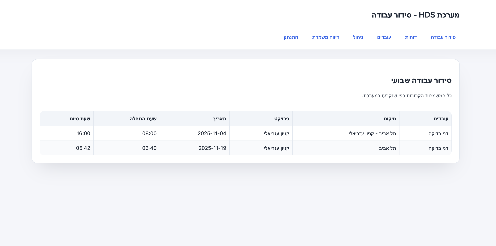
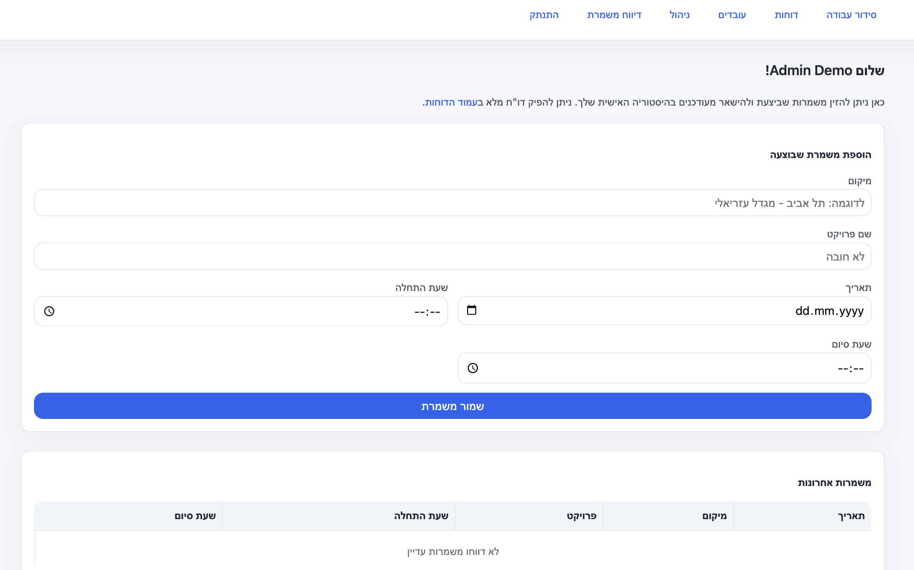
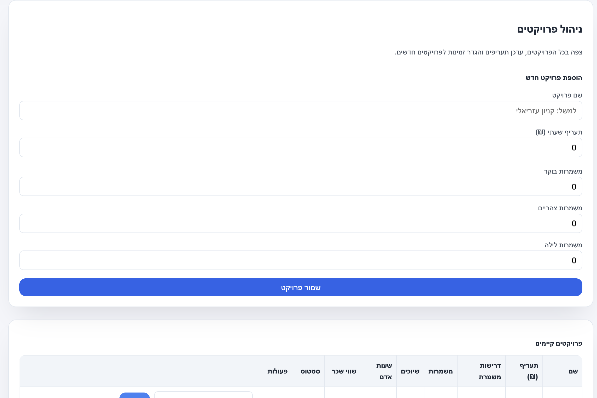

# Security Shift Scheduling System

FastAPI-based workforce scheduling platform for security companies. Employees can view and report shifts, managers define projects, availability, and staffing requirements, and an assignment engine builds schedules that respect preferences and constraints.

## Core Features

- **Employee Portal** – Secure login, upcoming shifts, manual shift reporting, and personal work-hour exports.
- **Admin Console** – Manage active employees, create projects with hourly rates and shift requirements (morning/afternoon/night), track availability and constraints, and monitor all assignments.
- **Shift Generator** – Constraint-aware engine that matches staff to required shifts while honoring preferences, blocked slots, and date rules.
- **Reporting & Costing** – Hourly-rate cost breakdowns per project and per employee with Excel export via `openpyxl`.
- **Embedded Database** – SQLite schema bootstrapped by `init_db()` including a dedicated `ShiftAssignments` table for many-to-many shift coverage.

## Tech Stack & Tooling

- **Backend**: FastAPI, Starlette sessions, Jinja2 templates.
- **Database**: SQLite (`database.db`) with helper logic in `app/db.py`.
- **Utilities**: Shift duration calculations and constraint helpers (`app/utils.py`), Excel export.
- **Frontend**: Jinja2 templates plus static CSS in `app/static`.
- **Testing**: `unittest` suite (`tests/test_scheduler.py`).

## Project Structure

```
security_scheduler/
├── app/
│   ├── main.py              # FastAPI application bootstrap & router wiring
│   ├── routes/
│   │   ├── employee.py      # Employee-facing endpoints
│   │   └── admin.py         # Admin UI, scheduler, reports
│   ├── templates/           # Jinja2 templates (RTL Hebrew UI)
│   ├── static/              # CSS, images, scripts
│   └── utils.py             # Shared helpers for hours/constraints
├── database.db              # Auto-created SQLite database
├── requirements.txt
└── tests/
    └── test_scheduler.py    # Scheduler unit tests
```

## Getting Started

1. **Clone & install dependencies**

   ```bash
   git clone <repo-url>
   cd security_scheduler
   python -m venv .venv
   source .venv/bin/activate  # Windows: .venv\Scripts\activate
   pip install -r requirements.txt
   ```

2. **Run the dev server**

   ```bash
   uvicorn app.main:app --reload
   ```

   The app listens on `http://127.0.0.1:8000`. Users must authenticate, so seed employees/admins first (see next section).

## Database Setup

- `database.db` is created automatically; `init_db()` also applies incremental schema upgrades when new columns are required.
- Create the initial admin via SQLite CLI:

  ```bash
  sqlite3 database.db <<'SQL'
  INSERT INTO employees (name, email, phone, password_hash, is_admin)
  VALUES ('System Admin', 'admin@example.com', '050-0000000',
          hex(randomblob(32)), 1);
  SQL
  ```

  Replace `password_hash` with a SHA-256 digest of the desired plaintext password (see `_hash_password` in `app/routes/employee.py`).

- Update the session secret by editing the `secret_key` used by `SessionMiddleware` in `app/main.py`.

## Running Tests

```bash
python -m unittest tests/test_scheduler.py
```

These tests cover the scheduling engine and constraint handling logic.

## Deployment Tips

- Serve Uvicorn behind a reverse proxy (Nginx/Gunicorn) and load secrets from environment variables or `.env`.
- Back up `database.db` frequently or migrate to a managed database (e.g., PostgreSQL) by replacing the SQLite connection layer.
- Consider exposing the existing `EmployeeAuthTokens` table through a password-reset workflow for safer account management.

## Future Enhancements

- Integrations with biometric time clocks or Google Calendar.
- Drag-and-drop or Gantt-style shift management UI.
- Push/SMS notifications for new or changed assignments.
- Public reporting API for BI dashboards.

## UI Preview

| Main Schedule | Admin Dashboard | Project Creation |
| --- | --- | --- |
|  |  |  |

---

Built with ❤️ for security teams. Open issues/PRs with ideas and improvements.
